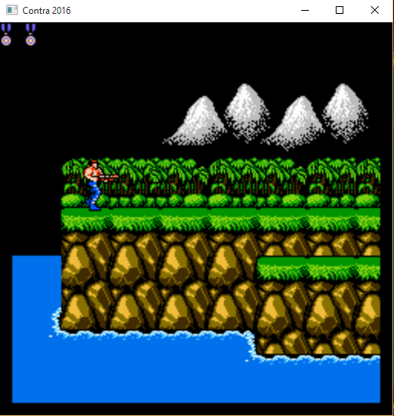
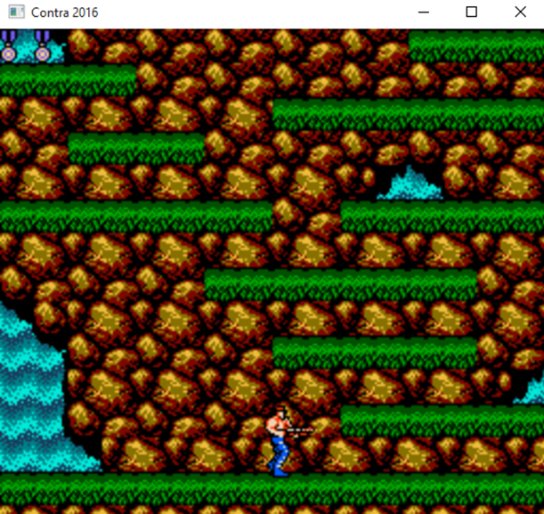

# NESContra

# **NHẬP MÔN PHÁT TRIỂN GAME**

## **Đề tài: Lập trình Game Contra bằng Directx9**

## Lớp: SE102.N21

Nhóm sinh viên thực hiện:

| Tên               | MSSV     |
| ----------------- | -------- |
| Phạm Tuấn Anh     | 21520147 |
| Phan Văn Minh     | 21522345 |
| Nguyễn Đức Phương | 21521307 |

### **Các kĩ thuật đã được áp dụng trong đồ án:**

- QuadTree
- AABB Collision
- Tiled Map
- Scrolling
- Sprite - Animation
- Component
- Physic
- Basic Math

## Các màn chơi

### 1) Màn 1: Jungle

### 2) **Màn 2: Water Fall**

